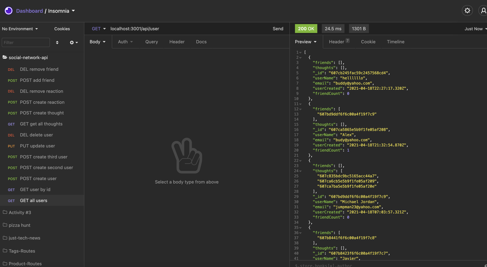
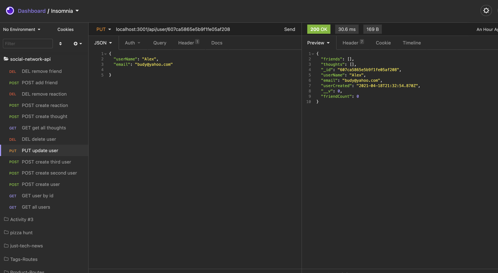
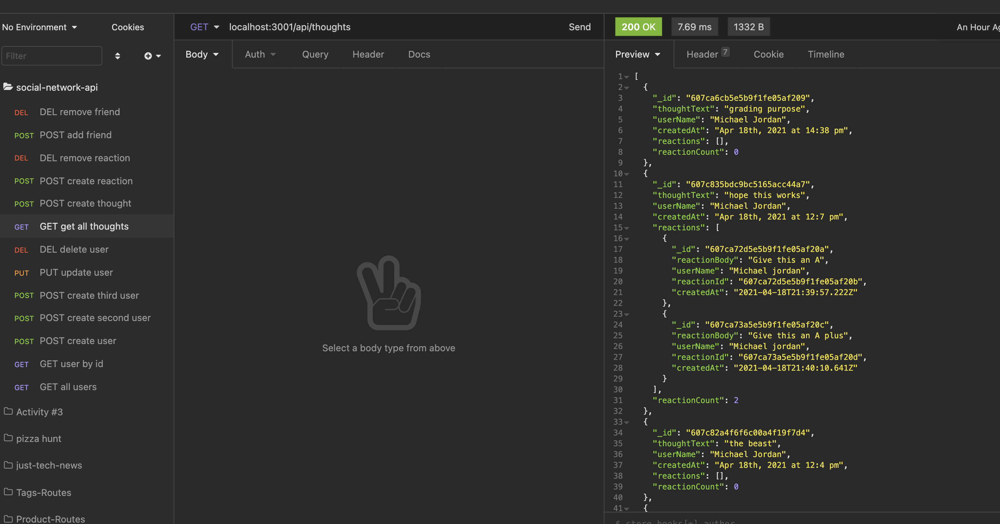
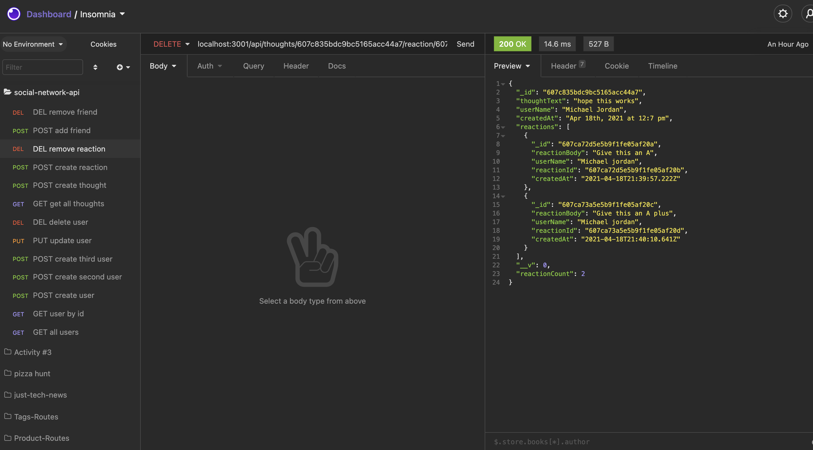
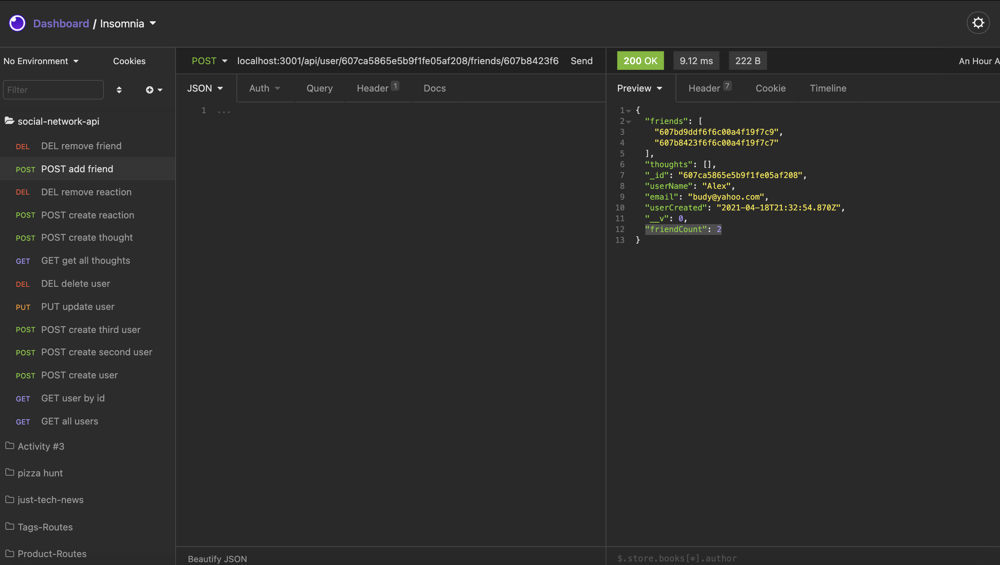

### Social Network API 
  
## Description
As a social media startup, I Want an API for my social network that uses a NoSQL database
SO that my website can handle large amounts of unstructured data.

  ##  Table of Contents
  * [Installation](#installation)
  * [Usage](#usage)
  * [License](#License)
  * [Contributing](#contributing)
  * [Tests](#Tests)
  * [Questions](#questions)
  
  ## Usage
  In order to run this application, you must fork my repo to your local machine and run it using npm start, before doing so please install to your local terminal Express and Mongoose.
  
  
  # License
  This project is  licensed MIT license.
  
  ## Contributing
  Contributors: Alex Reveles
  ## Test
  The following is needed to run the test: `npm start`.
  ## Questions
  If you have any questions regarding about the application, please contact me https://github.com/alexreveles or alexreveles@yahoo.com

### https://dashboard.heroku.com/apps/social-network-api-ar
### https://github.com/alexreveles/social-network-api
### https://github.com/alexreveles
https://drive.google.com/file/d/1qWsvqkGf8auBXMnnhwI6cWV2a2EEyixS/view

https://drive.google.com/file/d/1ynq5ughn6gXeJwBbplb3IBTCWRTTgePC/view

https://drive.google.com/file/d/14rMf-kTg7u_F2crboU2EECoFbZtpwhLh/view

